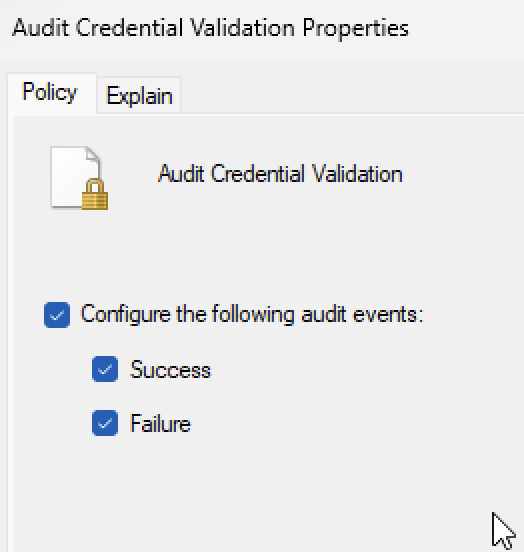
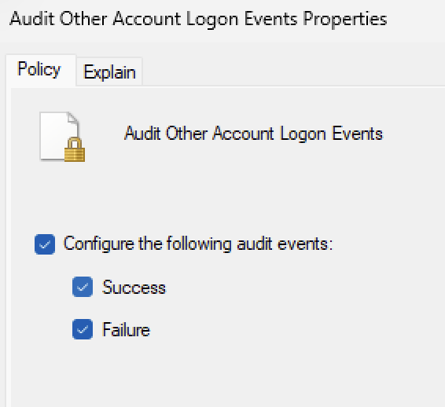
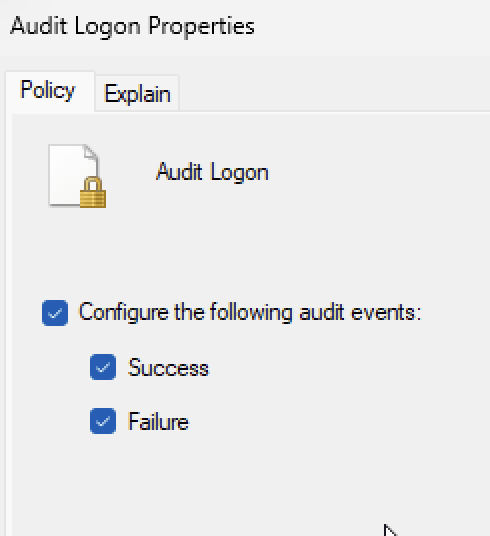
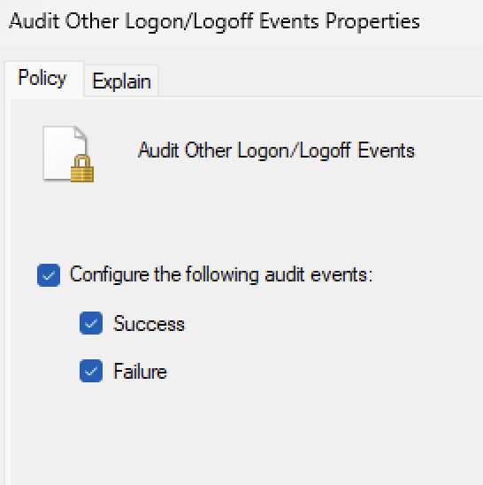

# Windows logs - level 3: Authentication event logs

This file documents how authentication logs behaves on Windows. While studying, I built two virtual machine to test my understanding. The first machine is running **Windows 11 Home** to simulate a personal device. For the second machine, i'm running **Windows 11 Pro** 

> For more information on how to setup Windows virtual machines, check out my [Windows VM setup repository](https://github.com/OliverStone01/Security-lab/blob/main/setup/windows-11-vm-setup.md)

-----

### what is an authentication event log?

An authentication event log is a type of log that is writen everytime the device checks the user or service is who they say they are. You can adjust the rules that tell the system when to record these logs by using `secpol.msc` for Windows Pro and `auditpol` for Windows Home.

-----

### Where do you look for authentication logs?

1. Open the `Event Viewer` application.
2. Expand `Windows Logs`.
3. Select `Security`.

Under `Security` you can monitor all authentication logs that have taken place on the machine up until you opened the application. You can select `refresh` from tool bar to gather newer logs (if there are any).

-----

### What does a `successful login event` look like?

Successful login Event ID = 4624.

This event means that Windows accepted credentials used to login and created a session. From this event, we can see who logged in, where they logged in, and how they logged in.

-----

### What does a `failed login event` look like?

Failed login Event ID = 4625.

This event means that the credentials used to sign in were rejected by the system. From this event, we can see if the username was wrong, if the password wrong, and where the attempt come from.

-----

### What does a `Account Lockout event` look like?

Account Lockout event ID = 4740.

This even means that the account is locked after repeated authentication failures. By default, the amount of fails is set to 10 before lockout. You can change this number from the **Local Security Policy**.

This event allows us to see which account was locked, when it happened, and what system triggered the lockout.

-----

### Setting up incorrect password rule using Local Security Policy (`secpol.msc`) for Windows Pro:

1. Logon to Windows Pro system.
2. Open `Local Security Policy (secpol.msc)` using `run` (`Win + R -> secpol.msc`).
3. Expand `Advanced Audit Policy Configuration`.
4. Expand `System Audit Policies`.
5. Select `Account Logon`.

6. Select `Audit Credential Validation`.
    - Configure the following audit events:
      - Tick `Success`.
      - Tick `Failure`.
      - Apply changes.

     
7. Select `Audit Other Account Logon Events`.
    - Configure the following audit events:
      - Tick `Success`.
      - Tick `Failure`.
      - Apply changes.

     
8. Select `Logon/Logoff`.

9. Select `Audit Logon`.
    - Configure the following audit events:
      - Tick `Success`.
      - Tick `Failure`.
      - Apply changes.
     

     
10. Select `Audit Other Logon/Logoff Events`.
    - Configure the following audit events:
      - Tick `Success`.
      - Tick `Failure`.
      - Apply changes.

     
11. Close `Local Security Policy (secpol.msc)`.
12. Restart the system.
13. Once you are propted to sign back in, input an incorrect password.
14. Log back in and open `Event viewer` and check for `invalid login logs`.

-----

