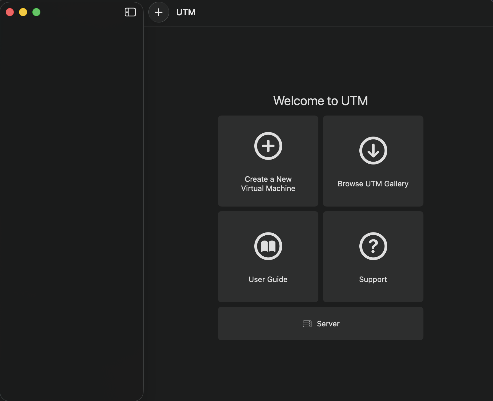
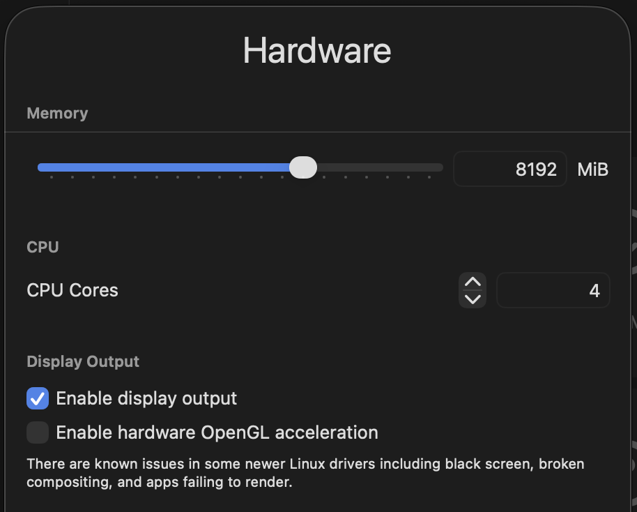
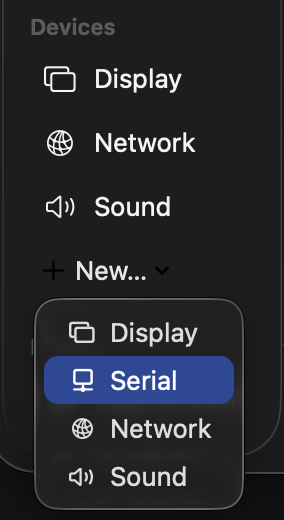
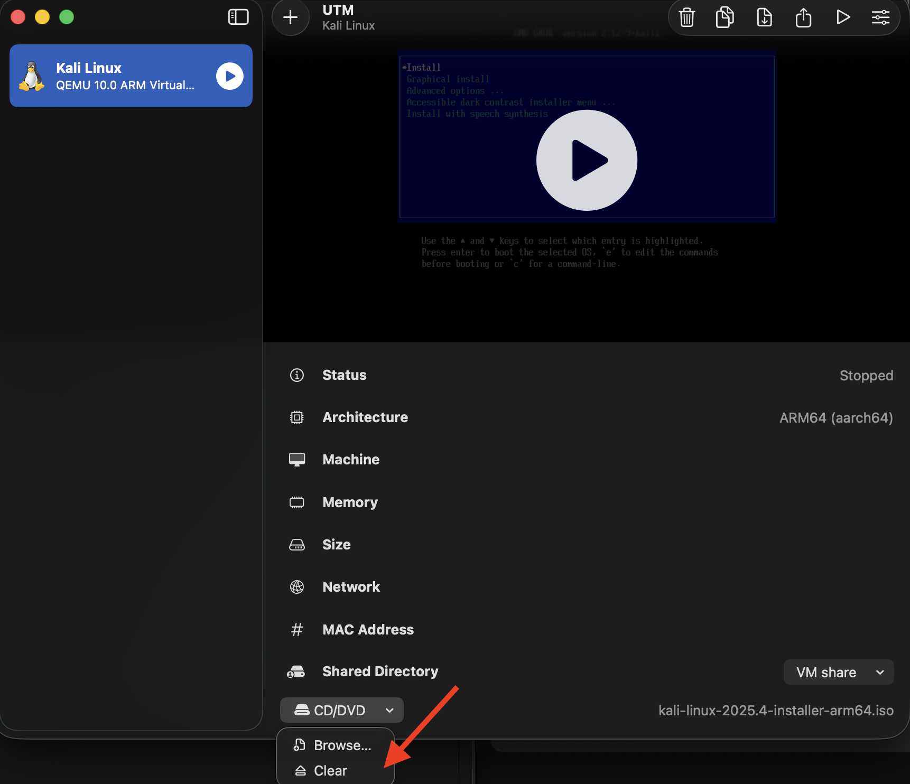

# Setting up a Kali Linux virtual machines on Mac

This guide lays out how I set up Virtual machines on an **Apple Silicon M4 Mac** using **UTM** software to run **Kali Linux**. I created this guide to help other beginners, CTF players, and security students who want a reliable Kali Linux virtual machine while bypassing and understanding common errors that occur during setup.

-----

### Recommended specs (at time of writing):  
    
**MacOS:** Tahoe 26.1  
**UTM version:** 4.7.4  
**Kali Linux version:**  kali-linux-2025.4  
**Storage Required:**  64 GB for best results (40 GB minimum).  
**Memory:**  6 GB for best results (4 GB minimum).  
**CPU Cores:** 4 for best results. (2 cores minimum)

-----

### Software Links:
Download the latest version of software for your device.  
    [UTM Downloader for Mac](https://mac.getutm.app)  
    [Kali Linux .iso boot file](https://www.kali.org/get-kali/#kali-installer-images)  

-----

### Downloading UTM for Mac
1. Go to **UTM downloader** via your browser or via this [link](https://mac.getutm.app).
2. Open the downloaded **UTM launcher** and follow steps to move UTM to the application folder.
3. You do **not** need to open UTM until you have downloaded the Kali linux OS in the next steps.

### Download latest Kali Linux .iso file
4. Go to the **Kali Linux OS installer** via your browser or via this [link](https://www.kali.org/get-kali/#kali-installer-images).
5. Click on **Installer images**.
6. Change processor to **Apple Silicon (ARM64)**.
7. Click on download under **Installer**.
8. **DO NOT OPEN** the .ISO file once it's downloaded.

### Setting up the virtual machine
9. Open the UTM application.


10. Click `Create a New Virtual Machine`
    
> **Virtualisation VS emulation**
>
> - **Virtualisation** runs software directly on your CPU using the same architecture (ARM -> ARM)  
> - **Emulation** translates every instruction pretending to be a different CPU architecture (x86 -> ARM)  
>
> Virtualisation is much quicker and is more stable compared to emulation.

11. Click on `Virtualise`.  
12. Choose `Linux` from the list of Operating Systems.  

> **Memory allocation**
> - **Bare Minimum: 2 GB (2048 MiB)** Boots but usability is limited.  
> - **Recommended Minimum: 4 GB (4096 MiB)** default.    
> - **Recommended: 8 GB (8192 MiB)** Recommended for good performance.  

> **CPU Core allocation**
> - **Bare Minimum: 2 cores** suitable for basic tasks.
> - **Recommended Minimum: 3 cores** smoother performance.
> - **Recommended: 4 cores** suitable for running multiple tasks without noticeable lag.

13. Set your memory and CPU core allocation as needed.
14. Leave `Display Output` as default:  


15. Set `Boot Image Type` to `Boot from ISO image`.
16. Under `Path` use the `Browse...` option and select the **Kali linux .iso file** you downloaded earlier.  

> **Storage**
> - **Bare Minimum:** 40GB
> - **Recommended Minimum:** 64GB
> - **Recommended:** 80-100GB

17. Set your storage allocation as needed.

> A **Shared directory** allows you to share files between the virtual machine and the main machine.

18. Set your shared directory location by using `Browse..`. Make sure to set a location that is convenient to access. For example, your Desktop.
19. Change the name to whatever you want to call the virtual machine.
21. Save the virtual machine.

> An issue I kept running into at this point was when I booted the VM, I would get a flashing underscore:


> After doing some investigating, I found out some Linux installers default to **serial output (terminal)** on ARM systems to avoid graphical driver issues which is why the GUI display doesn't display anything.
>
> To fix this, we can make the terminal appear on boot to then complete the setup steps.

22. Right click on the VM and click `edit`.
23. Under `Devices`:
    - Click `New...`.
    - Click `Serial`.
    - Then Save.



24. Boot the VM (2 windows will appear, the **GUI** and the **terminal**).

### Kali Linux setup
Using the Terminal, follow the following setup steps.

25. Press **enter** on `Install`.
26. Press **enter** on `English`.
27. Press **enter** on your location.
28. Press **enter** on the key map (keyboard layout) you want to use.

> The install will then begin...

29. Enter a `hostname`.
30. Enter a `Domain name`.
31. Enter a `name` for the user.
32. Enter a `username`.
33. Enter a `new password`.
34. Re-enter the password.

> Wait for the install to complete...

35. Select `Guided - Use entire disk`.
36. Select `Virtual disk 1 (vda)`.
37. Select `All files in one partition`.
38. Select `Finish partitioning and write changes to disk`.
39. Select `Yes` to write the changes to disk.
40. Select `Continue` to install packages and other software.

> This install will take around 10 minutes.

41. Once the install is complete, select `continue` and the system will reboot.
42. When you see the installer menu again, close and stop the VM.
43. Select your VM from the list on the **UTM application**.
44. At the bottom of the information panel on the right, click the drop down for `CD/DVD`.
45. Click `Clear` to clear the .iso file.


-----

### First boot
46. After clearing the .iso file, boot the VM and login with the credentials you created earlier.
47. Open a terminal and run:
```
sudo apt update
```
48. Once the update is complete, run:
```
sudo apt upgrade
```

You now have successfully setup a virtual machine running Kali linux on Mac.

-----

### Closing your virtual machine
When closing the virtual machine, it is important to close down the machine first before terminating the machine via UTM. If you fail to shut down the virtual machine first, your data may not be written to disk and may be lost.

**Methods to shutting down the VM:**
- Via Terminal:
```
# Method 1
shutdown now

# Method 2
poweroff
```

- Via GUI  
    **Method 1**
    - Click on `menu` in the top left of the toolbar.
    - Click `Logout` in the bottom right of the menu.
    - Click `Shutdown` on the pop up menu.
 
    **Method 2**
    - Click `Logout` in the top right of toolbar.
    - Click `Shutdown` on the pop up menu.
 

Once you have successfully shutdown the machine, you can close the VM windows.


