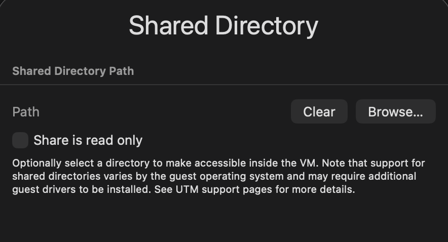
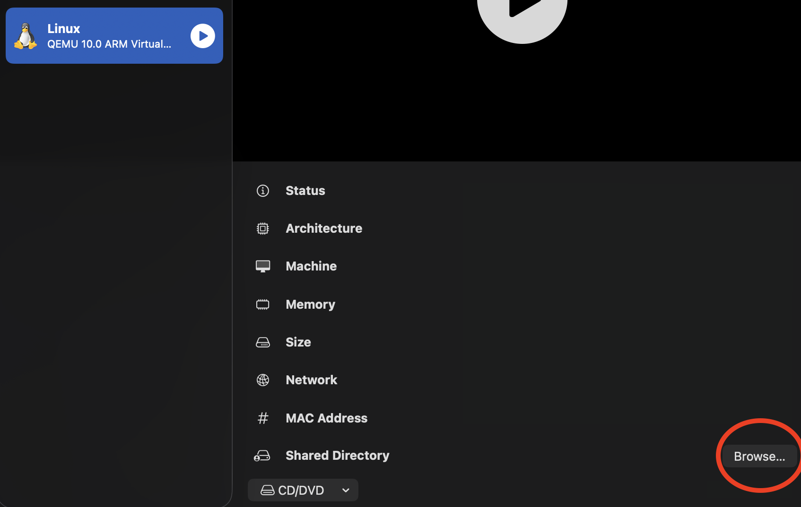
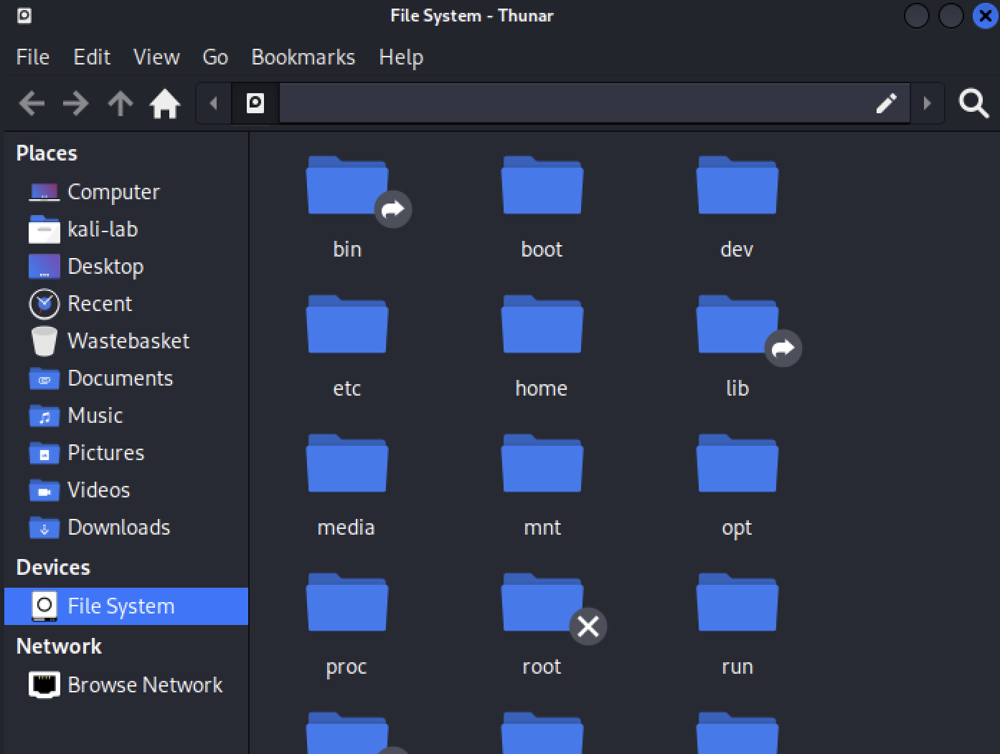
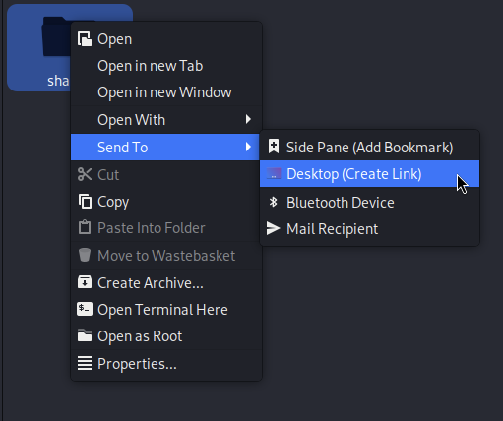

# Setting up a shared folder between a host and virtual machine

This guide lays out how I set up a **shared folder** between my host machine **(Apple Silicon M4 Mac)** and my virtual machine **(Kali Linux OS)**.  

If you have not yet set up your vm, you can use [my guide here](https://github.com/OliverStone01/Security-lab/blob/main/setup/vm-setup-mac.md) which walks through how to set up Kali Linux virtual machines on Mac using UTM.

-----

**PLEASE NOTE:** Directory sharing is **not persistent** and will reset every time you restart your VM. I personally believe this is for the best as it helps prevent attackers or malware from getting access to your host system via your VM.  

For this reason, I have created a script that you can add to your VM and run from the terminal to **activate or deactivate** directory sharing when needed. Each time sharing is enabled or disabled, you will be asked to enter your password.  

It is possible to change `sudo` permissions to allow mounting and unmounting without needing to enter your password but this increases risk and removes an element of **least privilege**. Since you already need to enter your password when setting up directory sharing manually, I believe this is a fair trade off for improved security without needing to manually run commands each time.

-----

### Specifications (at the time of writing):
**MacOS:** Tahoe 26.1  
**UTM version:** 4.7.4  
**Kali Linux version:**  kali-linux-2025.4

-----
### Setting up your folder on your host machine.

1. Create a folder on your host machine.
2. Create a file inside your folder called `test.txt`.

> By creating this file, we can later check if the connection worked inside the VM.

-----

### Setting up the shared folder on UTM application:

**If you are still setting up your VM:**  
When asked to set up the `shared directory`, set the path to your folder on your host machine you created earlier.



**If your VM is already set up:**
- Go to the UTM application.
- Select your VM.
- In the information table on the right, find `Shared Directory` and select `Browse...`.
- Select the folder you created earlier.



-----
> The manual method is useful for troubleshooting and understanding what's happening under the hood.
> 
> The automated script method is recommended for daily use.
-----

### MANUAL METHOD for setting up the shared folder in the VM:

1. Boot your VM and login.
2. Once you're logged in, Open a terminal.
3. In your terminal, run these commands:
```
# First command (Creates a folder called "Share" in the /mnt directory) 
$ sudo mkdir -p /mnt/share
```
> The reason we use the `/mnt` directory is because in Linux, this is the location for temporary or manually mounted filesystems. We will later create a shortcut to this folder which you can place on your VMs desktop for easy access.
>
> This command only needs to be run once to create the **share folder**. Once this folder has been created, you **do not need to run this command next time** you want to connect to the shared directory.

```
# Second command (Mounts the share folder)
$ sudo mount -t 9p -o trans=virtio share /mnt/share
```
> This is the command you will need to run each time you start your VM if you continue with the manual method.
-----

### Checking the connection:

We can check the connection by checking if the `test.txt` file appears in the `share` folder. From a terminal, enter this command:
```
# Checking for test.txt file in the share folder
$ ls /mnt/share
```

If you see `test.txt` as a result, the connection has worked.

-----

### Creating a Desktop shortcut

1. On your VM, open `File System` from your Desktop or file explorer.


2. Open your `mnt` folder
3. Right click (Two finger click on Mac) on the `share` folder.
4. Click on `Send To`
5. Click on `Desktop (Create Link)`



On your Desktop, you will now see a new folder which is linked to your share folder.

-----

### AUTOMATED SCRIPT METHOD for setting up the shared folder in the VM:

1. Boot your VM and login.
2. Once your logged in, you can either download the script from my GitHub [here](https://github.com/OliverStone01/Security-lab/blob/main/tools/custom-tools/toggle-share.sh). Or you can manually follow along below:

### Creating the script:
3. In your terminal, create the script file by running
```
$ nano ~/Desktop/toggle-share.sh
```
4. When the editor opens, paste this code:
```
#!/bin/bash

SHARE_FOLDER="/mnt/share"

# Check if share folder exists
if [ ! -d "$SHARE_FOLDER" ]; then
        echo "Creating share folder."
        sudo mkdir -p "$SHARE_FOLDER"
fi

# Check if the directory is mounted
if mountpoint -q "$SHARE_FOLDER"; then
        echo "Stopping Directory Share..."
        sudo umount "$SHARE_FOLDER"
else
        echo "Starting Directory Share..."
        sudo mount -t 9p -o trans=virtio share "$SHARE_FOLDER"
fi
```
5. To save, do `control + o` on your keyboard.
6. Then close the editor with `control + x` on your keyboard.

-----

### Running the script.

**Terminal method:**  
> Make sure you are in the same directory where you saved the `toggle-share.sh` script before running the command.
>
> If you followed the script set up steps above, your script will be in the `/Desktop` directory.
>
> If you downloaded the script, it will be in your /Downloads directory.

1. Open your terminal and run:
```
./toggle-share.sh
```

**Manual method:**
1. Right click the script file
2. Click on `Open with Terminal Emulator`

> If you do not see `Open with Terminal Emulator`, Click on `Open with Other Application...`. Then find `Terminal Emulator` in the list of applications.


