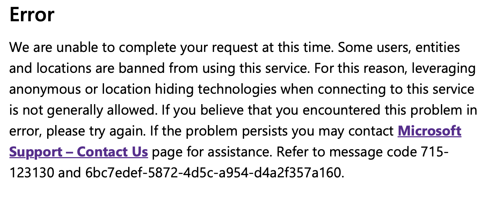
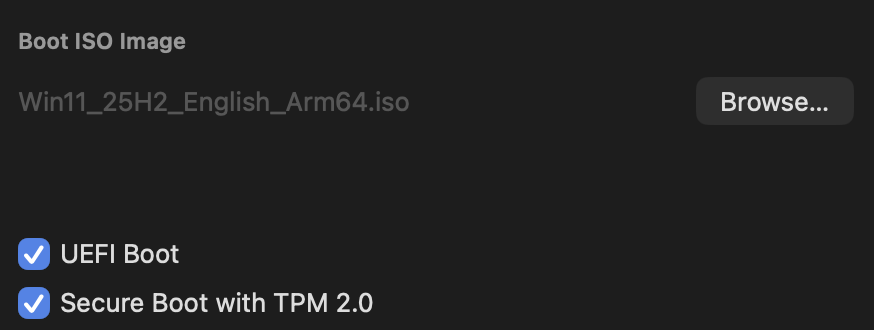
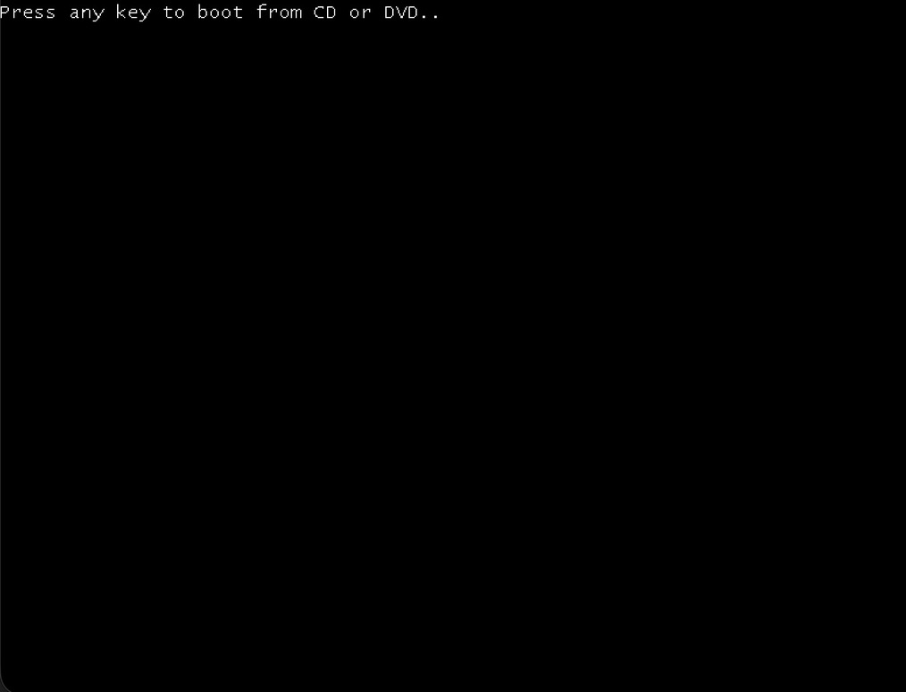
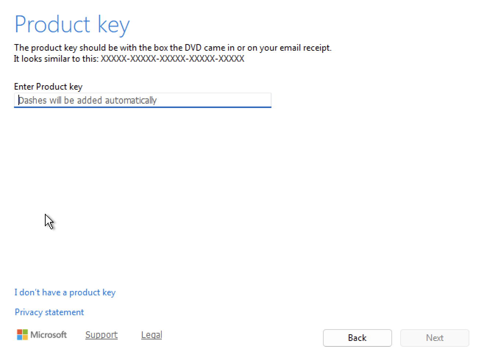
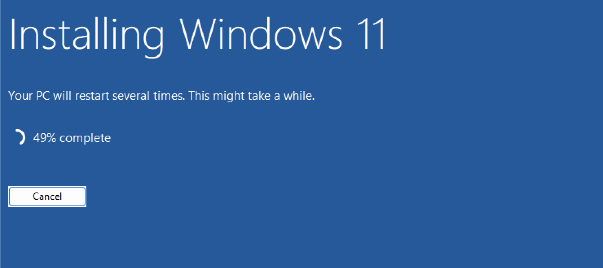
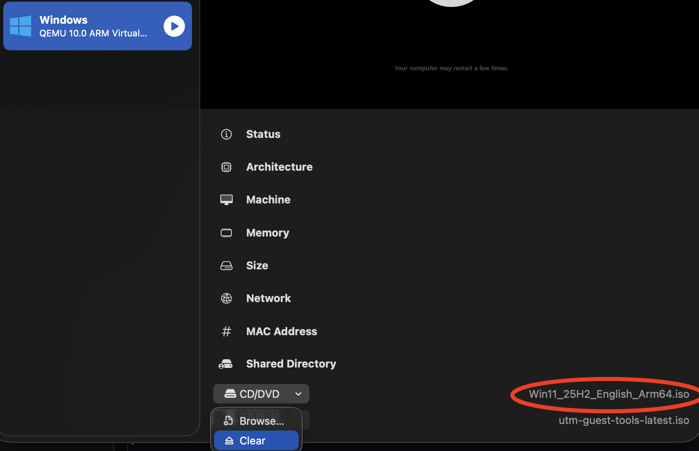
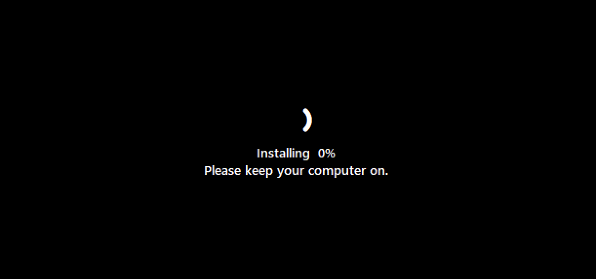
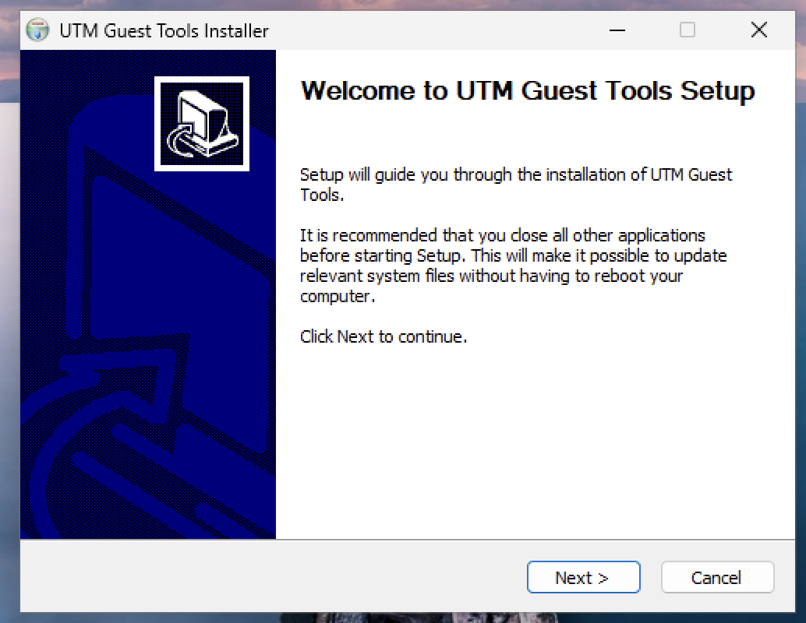

# Setting up a Windows 11 virtual machines on Mac

This guide lays out how I set up Virtual machines on an **Apple Silicon M4 Mac** using **UTM** software to run **Windows 11**. I created this guide to help other beginners, CTF players, and security students who want a reliable Windows 11 virtual machine while bypassing and understanding common errors that occur during setup.

-----
### Recommended specs (at time of writing):

**MacOS:** Tahoe 26.1  
**UTM version:** 4.7.4  
**Windows 11 version:** Windows 11 2025 Update l Version 25H2  
**Storage Required:**  64 GB for best results (40 GB minimum).  
**Memory:**  6 GB for best results (4 GB minimum).  
**CPU Cores:** 4 for best results. (2 cores minimum)

-----

### Software Links:
Download the latest version of software for your device.  
    [UTM Downloader for Mac](https://mac.getutm.app)  
    [Windows 11.iso boot file](https://www.microsoft.com/en-us/software-download/windows11arm64)

-----

### Downloading UTM for Mac
1. Go to **UTM downloader** via your browser or via this [link](https://mac.getutm.app).
2. Open the downloaded **UTM launcher** and follow steps to move UTM to the application folder.
3. You do **not** need to open UTM until you have downloaded the Kali linux OS in the next steps.

-----

### Downloading the latest Windows 11 ARM .iso file

> **IMPORTANT NOTE:**  
> When I tried to install the .iso file using Safari, I got this error:

> The solution is to use a Chrome Browser to download the .iso file.

4. Go to the [Windows 11 ARM installer](https://www.microsoft.com/en-us/software-download/windows11arm64) via a Chrome browser and download the latest .iso file.

5. **DO NOT OPEN** the .iso file once it's downloaded.

-----

### Setting up the virtual machine

6. Open the UTM application.

7. Click `Create a New Virtual Machine`.

> **Virtualisation VS emulation**
>
> - **Virtualisation** runs software directly on your CPU using the same architecture (ARM -> ARM)  
> - **Emulation** translates every instruction pretending to be a different CPU architecture (x86 -> ARM)  
>
> Virtualisation is much quicker and is more stable compared to emulation.

8. Click on `Virtualise`.
9. Choose `Windows` from the list of Operating Systems.

> **Memory allocation**
> - **Bare Minimum: 4 GB (4096 MiB)**.  
> - **Recommended Minimum: 6 GB (6144 MiB)**  
> - **Recommended: 8 GB (8192 MiB)** Recommended for good performance.  

> **CPU Core allocation**
> - **Bare Minimum: 2 cores** suitable for basic tasks.
> - **Recommended Minimum: 3 cores** smoother performance.
> - **Recommended: 4 cores** suitable for running multiple tasks without noticeable lag.

10. Set your memory and CPU core allocation as needed.
11. For boot option, use the `Browse...` option and select the **Windows 11 .iso file** you downloaded earlier.

> **Storage**
> - **Recommended Minimum:** 64GB
> - **Recommended:** 80-100GB

12. Set your storage allocation as needed.

> A **Shared directory** allows you to share files between the virtual machine and the main machine.

13. Set your shared directory location by using `Browse..`. Make sure to set a location that is convenient to access. For example, your Desktop.

14. Change `name` to whatever you want to call the virtual machine.
15. Save the virtual machine.

-----

### Installing Windows 11

16. Press play on your VM to boot for the first time.
17. When prompted to `press enter or any key`, make sure you press enter to prevent input error.

18. Set your `language` and `time and currency format`.
19. Set your keyboard settings.
20. When prompted for a product key, select `I don't have a product key`.

21. Select the version of windows you would like to use. For this example, I will select `Windows 11 Home`.
22. Read and `Accept` the software license terms.
23. Select the location to install windows.

> Select the disk that has the same size as you allocated previously.

> Windows will now begin installing.

24. Once the first intall has complete, the VM will restart. Terminate your VM before the second install.

25. Select your VM in the UTM application.
26. At the bottom of the information panel on the right, there are two drop downs that say `CD/DVD`. Click the drop down for the .iso file and click `clear`.

27. Boot the VM again.

> The second install will now begin. Exepct your VM to restart atleast once.

-----

### Setting up Windows 11

> Once the install is complete, you will be prompted to setup Windows 11.

28. Select your country.
29. Select your keyboard layout.
30. Skip or add a second keyboard layout.
31. Enter the name of the user.
32. Enter a password for the user.
33. Re-enter the password.
34. Create 3 security questions

> Windows will now begin to set up your system.

-----

### UTM Guest tools setup

When your machine loads for the first time, you will be prompted to install the `UTM Guest tools`.

35. Click next and the tools will begin to install.
36. Click finish.

-----

