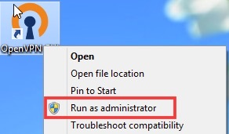
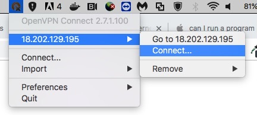

# OpenVPN

This document is about how to use OpenVPN on any operating system. OpenVPN is a free, open source VPN client that I use on my `attack box` to connect to external lab networks like `Try Hack Me`.  

You can download openVPN [here](https://openvpn.net).  
Or you can download the software via the terminal with this command:
```
$ sudo apt install openvpn
```

Before you can connect to a network, you first need to download the `configuration` file for the network you are trying to get access to.

-----

### Linux
1. Locate the full path to your configuration file.
2. Run the following command:
```
$ sudo openvpn /path-to-file/file-name.ovpn
```

**To disconnect:**
1. Press `Ctrl + c` on the terminal that is running the VPN.

-----

### Windows:
1. Right click on the `OpenVPN icon`.
2. Click on `Run as administrator`.



> The application will start running in the system tray.

3. Right click on the application in the system tray.
4. Click on `Import File...`.


5. Select the configuration file downloaded earlier.
6. Right click on the application in the system tray again.
7. Select your file and click `Connect`.


**To disconnect:**
1. Right click on the application in the system tray.
2. Select your file and click `Disconnect`.

-----

### MacOS:
1. Start the application

> You will see the application running in the top bar.

2. Right click on the application icon and click `Import File -> Local file`.


3. Select the configuration file downloaded earlier.
4. Right click on the application icon again.
5. Select your file and click connect.



**To disconnect:**
1. Right click on the application icon.
2. Select your file and click `Disconnect`.

-----

